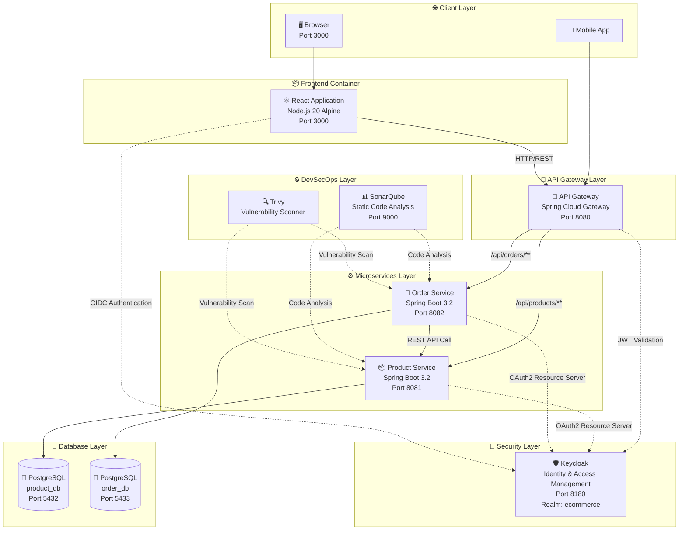
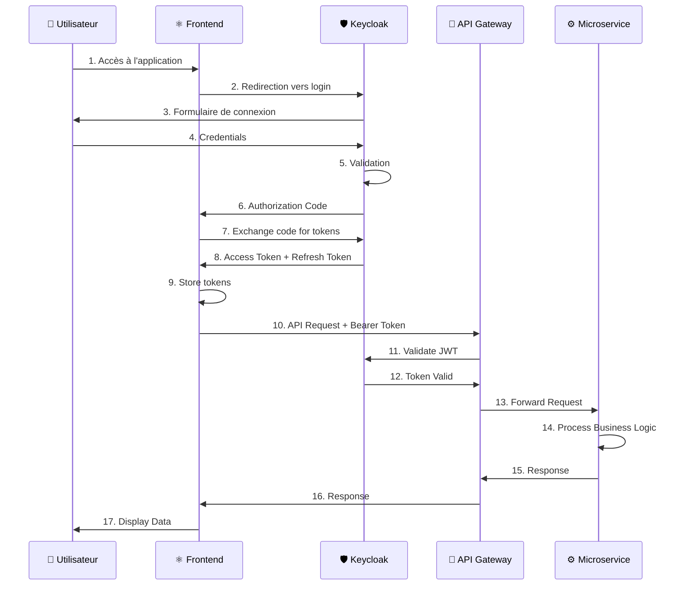
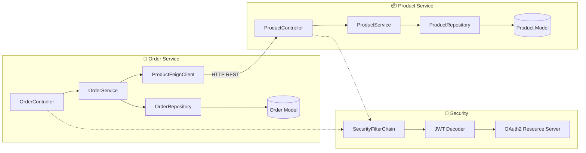
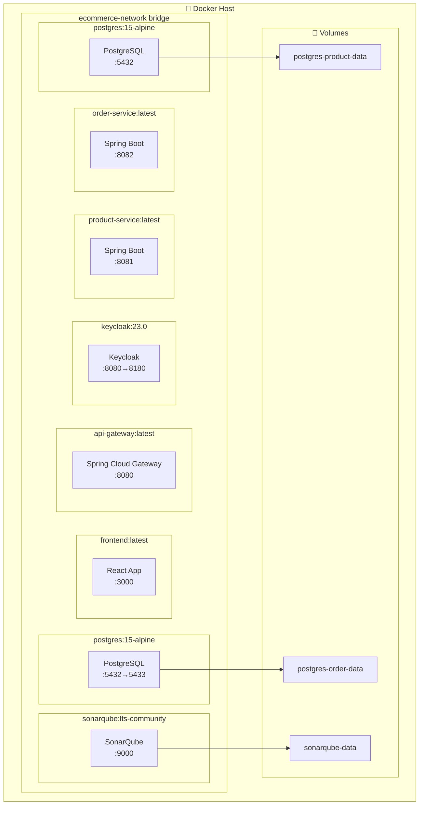
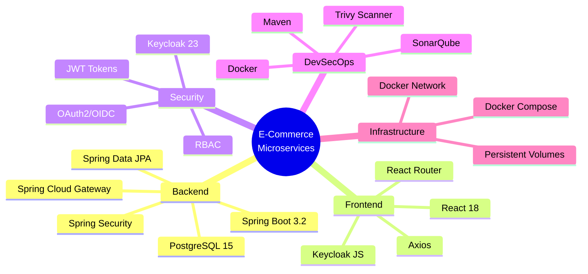
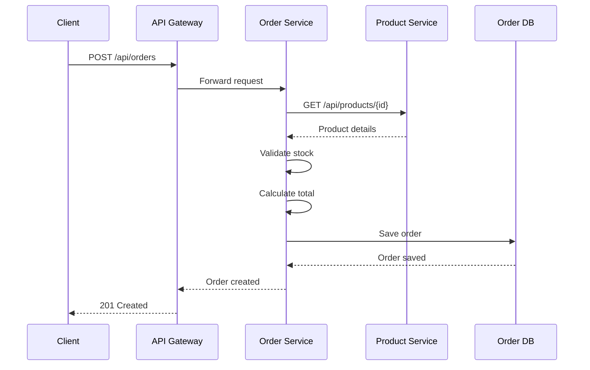
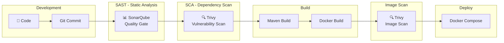

# Diagrammes d'Architecture Mermaid - E-Commerce Microservices

## 1. Vue d'Ensemble du Système

## 2. Flux d'Authentification OAuth2/OIDC

## 3. Architecture des Microservices (Interne)

## 4. Diagramme de Déploiement Docker

## 5. Stack Technologique

## 6. Flux de Création de Commande

## 7. Pipeline DevSecOps

---

## Tableau Récapitulatif des Services

| Service | Port | Image | Description |
|---------|------|-------|-------------|
| Frontend | 3000 | Node 20 Alpine | Application React |
| API Gateway | 8080 | Java 17 | Routage et sécurité |
| Product Service | 8081 | Java 17 | Gestion des produits |
| Order Service | 8082 | Java 17 | Gestion des commandes |
| Keycloak | 8180 | Keycloak 23 | Identity Provider |
| PostgreSQL Product | 5432 | Postgres 15 | Base produits |
| PostgreSQL Order | 5433 | Postgres 15 | Base commandes |
| SonarQube | 9000 | SonarQube LTS | Analyse de code |

## Résultats DevSecOps

### SonarQube
- ✅ Product Service: **16 fichiers** analysés
- ✅ Order Service: **23 fichiers** analysés

### Trivy - Vulnérabilités Dépendances
| Service | Total | Critical | High | Medium | Low |
|---------|-------|----------|------|--------|-----|
| product-service | 43 | 3 | 19 | 15 | 6 |
| order-service | 54 | 3 | 23 | 21 | 7 |
