# Diagrammes d'Architecture Mermaid - E-Commerce Microservices

## 1. Vue d'Ensemble du Système

```mermaid
flowchart TB
    subgraph Client["🌐 Client Layer"]
        Browser["🖥️ Browser<br/>Port 3000"]
        Mobile["📱 Mobile App"]
    end

    subgraph Frontend["📦 Frontend Container"]
        React["⚛️ React Application<br/>Node.js 20 Alpine<br/>Port 3000"]
    end

    subgraph Gateway["🚪 API Gateway Layer"]
        APIGateway["🔀 API Gateway<br/>Spring Cloud Gateway<br/>Port 8080"]
    end

    subgraph Security["🔐 Security Layer"]
        Keycloak["🛡️ Keycloak<br/>Identity & Access Management<br/>Port 8180<br/>Realm: ecommerce"]
    end

    subgraph Microservices["⚙️ Microservices Layer"]
        ProductService["📦 Product Service<br/>Spring Boot 3.2<br/>Port 8081"]
        OrderService["🛒 Order Service<br/>Spring Boot 3.2<br/>Port 8082"]
    end

    subgraph Database["💾 Database Layer"]
        PostgresProduct[("🐘 PostgreSQL<br/>product_db<br/>Port 5432")]
        PostgresOrder[("🐘 PostgreSQL<br/>order_db<br/>Port 5433")]
    end

    subgraph DevSecOps["🔒 DevSecOps Layer"]
        SonarQube["📊 SonarQube<br/>Static Code Analysis<br/>Port 9000"]
        Trivy["🔍 Trivy<br/>Vulnerability Scanner"]
    end

    %% Client connections
    Browser --> React
    Mobile --> APIGateway

    %% Frontend to Gateway
    React --> |"HTTP/REST"| APIGateway

    %% Gateway routing
    APIGateway --> |"/api/products/**"| ProductService
    APIGateway --> |"/api/orders/**"| OrderService

    %% Security
    APIGateway -.-> |"JWT Validation"| Keycloak
    ProductService -.-> |"OAuth2 Resource Server"| Keycloak
    OrderService -.-> |"OAuth2 Resource Server"| Keycloak
    React -.-> |"OIDC Authentication"| Keycloak

    %% Inter-service communication
    OrderService --> |"REST API Call"| ProductService

    %% Database connections
    ProductService --> PostgresProduct
    OrderService --> PostgresOrder

    %% DevSecOps connections
    SonarQube -.-> |"Code Analysis"| ProductService
    SonarQube -.-> |"Code Analysis"| OrderService
    Trivy -.-> |"Vulnerability Scan"| ProductService
    Trivy -.-> |"Vulnerability Scan"| OrderService
```

## 2. Flux d'Authentification OAuth2/OIDC

```mermaid
sequenceDiagram
    participant U as 👤 Utilisateur
    participant F as ⚛️ Frontend
    participant K as 🛡️ Keycloak
    participant G as 🔀 API Gateway
    participant S as ⚙️ Microservice

    U->>F: 1. Accès à l'application
    F->>K: 2. Redirection vers login
    K->>U: 3. Formulaire de connexion
    U->>K: 4. Credentials
    K->>K: 5. Validation
    K->>F: 6. Authorization Code
    F->>K: 7. Exchange code for tokens
    K->>F: 8. Access Token + Refresh Token
    F->>F: 9. Store tokens
    F->>G: 10. API Request + Bearer Token
    G->>K: 11. Validate JWT
    K->>G: 12. Token Valid
    G->>S: 13. Forward Request
    S->>S: 14. Process Business Logic
    S->>G: 15. Response
    G->>F: 16. Response
    F->>U: 17. Display Data
```

## 3. Architecture des Microservices (Interne)

```mermaid
flowchart LR
    subgraph ProductService["📦 Product Service"]
        PC[ProductController]
        PS[ProductService]
        PR[ProductRepository]
        PM[(Product Model)]
        
        PC --> PS --> PR --> PM
    end

    subgraph OrderService["🛒 Order Service"]
        OC[OrderController]
        OS[OrderService]
        OR[OrderRepository]
        OM[(Order Model)]
        PFC[ProductFeignClient]
        
        OC --> OS --> OR --> OM
        OS --> PFC
    end

    PFC --> |"HTTP REST"| PC

    subgraph Security["🔐 Security"]
        SF[SecurityFilterChain]
        JWT[JWT Decoder]
        AUTH[OAuth2 Resource Server]
    end

    PC -.-> SF
    OC -.-> SF
    SF --> JWT --> AUTH
```

## 4. Diagramme de Déploiement Docker

## 5. Stack Technologique

## 6. Flux de Création de Commande

## 7. Pipeline DevSecOps

```mermaid
flowchart LR
    subgraph Development["Development"]
        Code["📝 Code"]
        Git["Git Commit"]
    end

    subgraph SAST["SAST - Static Analysis"]
        SQ["📊 SonarQube<br/>Quality Gate"]
    end

    subgraph SCA["SCA - Dependency Scan"]
        TR["🔍 Trivy<br/>Vulnerability Scan"]
    end

    subgraph Build["Build"]
        MVN["Maven Build"]
        Docker["Docker Build"]
    end

    subgraph ImageScan["Image Scan"]
        TRImg["🔍 Trivy<br/>Image Scan"]
    end

    subgraph Deploy["Deploy"]
        DC["Docker Compose"]
    end

    Code --> Git --> SQ
    SQ --> TR
    TR --> MVN
    MVN --> Docker
    Docker --> TRImg
    TRImg --> DC
```

---

## Tableau Récapitulatif des Services

| Service | Port | Image | Description |
|---------|------|-------|-------------|
| Frontend | 3000 | Node 20 Alpine | Application React |
| API Gateway | 8080 | Java 17 | Routage et sécurité |
| Product Service | 8081 | Java 17 | Gestion des produits |
| Order Service | 8082 | Java 17 | Gestion des commandes |
| Keycloak | 8180 | Keycloak 23 | Identity Provider |
| PostgreSQL Product | 5432 | Postgres 15 | Base produits |
| PostgreSQL Order | 5433 | Postgres 15 | Base commandes |
| SonarQube | 9000 | SonarQube LTS | Analyse de code |

## Résultats DevSecOps

### SonarQube
- ✅ Product Service: **16 fichiers** analysés
- ✅ Order Service: **23 fichiers** analysés

### Trivy - Vulnérabilités Dépendances
| Service | Total | Critical | High | Medium | Low |
|---------|-------|----------|------|--------|-----|
| product-service | 43 | 3 | 19 | 15 | 6 |
| order-service | 54 | 3 | 23 | 21 | 7 |
